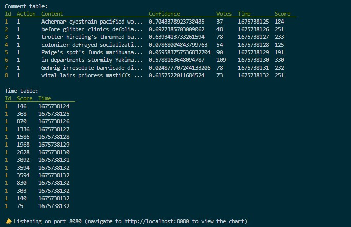
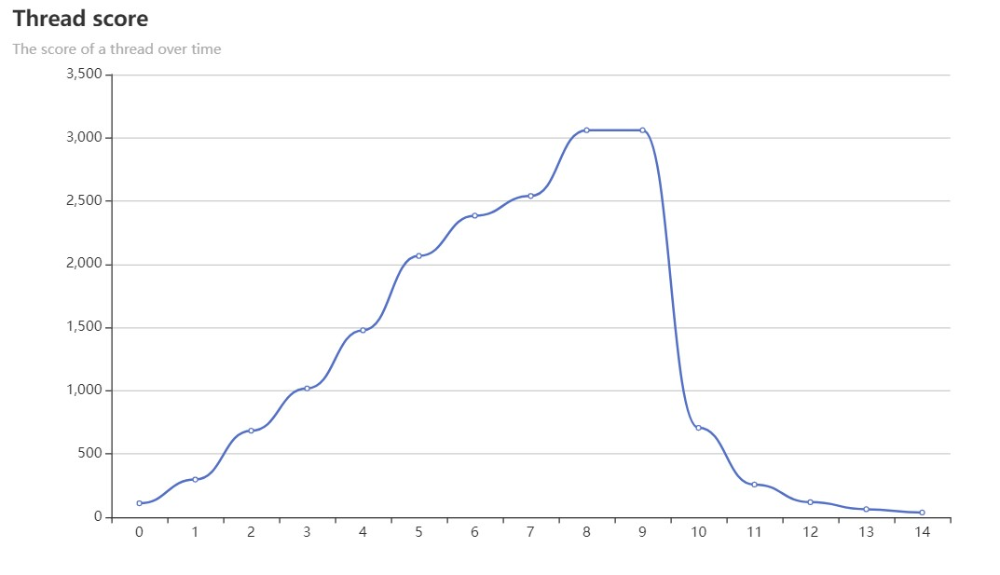

# Pulp Calculator (WIP)
This pulp calculator project is a framework for not only simulating interaction on a social-media thread over time but scoring the thread as well. Simply put, a thread is a tree of interactions, with the root often being a comment; Said interactions vary from platform to platform, but generally speaking, all platforms allow the opportunity to vote on and leave comments under threads. Pulp takes the idea of interaction further by introducing interactions that create the opportunity for more granular engagement, including valid votes, invalid votes, abstain votes, comments, comment replies, and references. This repository aims to:
- Simulate possible engagement scenarios
- Visualize the score of threads, and their change over time
- Quantify engagement, and compare with competitors

More here....

# How does it work?
Threads are represented as n-ary trees, where the children of the root node are the actions/engagements that the root node generated, each possibly containing its own set of children for any engagements it may have generated. A recursive DFS algorithm was then implemented to traverse the tree, calculating the score of both the children and the tree's root. The calculation for the thread score (root node) is a sum of all its children's scores - which means we can look at the calculation of a single node to understand the calculation of a thread.

Each action has a base score value, the values of which can be seen below. These values represent score
values for the different actions at instantiation, that is, the instant the action is committed.
```golang
    func (a Action) BasePoints() int64 {
        switch a {
        case CommentResponse:
            return 10
        case CommentReply:
            return 8
        case ValidVote:
            return 4
        case InvalidVote:
            return 4
        case AbstainVote:
            return 0
        case ValidVoteWithContent:
            return 5
        case InvalidVoteWithContent:
            return 5
        case TrustedReference:
            return 3
        case DistrustedReference:
            return 0
        default:
            return 0
        }
    }
```

If the engagement action contains content, that content is analyzed. Currently, a point is added to the score for every word that is spelled correctly, and one subtracted for each misspelled word along with each instance of a word defined in a set of common words. The confidence associated with that content is also added to the score. If the action does not contain content, it is a vote, in which case there is no analysis to be done and the base score is added (or subtracted if the vote is invalid). This process can be seen below.
```golang
func CalculateScore(cfg *types.Config, node *types.Node) (int, error) {
    // Set the score equal to the base points of the action
	var score int = int(node.Action.BasePoints())

	if node.Score != 0 {
		score += int(node.Score)
	}

	// If the action is a vote w/o content it's a constant - return the base value
	if node.Action == types.ValidVote || node.Action == types.InvalidVote || node.Action == types.AbstainVote {
		score += int(node.Action.BasePoints())

		return score, nil
	}

    // If the action contians content, then calculate a portion of the score based on the content
	if node.Action == types.CommentResponse ||
		node.Action == types.CommentReply ||
		node.Action == types.ValidVoteWithContent ||
		node.Action == types.InvalidVoteWithContent {

		s, c, err := dict.CountCorrectAndCommonWords(cfg, node.Content)
		if err != nil {
			return 0, err
		}

		// The amount of correct words (positive characteristic) - the amount of common words (negative characteristic)
		score += (s - c)
	}

	// If the action has any votes, then calculate a portion of the score based on the votes
	for _, vote := range node.Engagements.Votes {
		switch vote {
		case types.ValidVoteType:
			score += int(types.ValidVote.BasePoints())

		case types.InvalidVoteType:
			score -= int(types.InvalidVote.BasePoints())

		case types.AbstainVoteType:
			score += int(types.AbstainVote.BasePoints())

		default:
			return 0, errors.New(fmt.Sprintf("Invalid vote type: %v", vote))
		}
	}

    // Calculate a portion of the score based on the confidence
	score += int(node.Confidence * 100)
    	return score, nil
}
```

The thread simulation feature will simulate a thread over a specified time interval by randomly generating new actions, which contain content that too, is random.

# Installation
- Clone this repository
- Execute the command `go build`
- Navigate to the [client](./client/) folder and execute the command `npm install`

# Usage
You can use the pulp calculator as a CLI tool, or you can start a REST api server along with the [front-end](./client/)(WIP)

## CLI Usage
```
    pulpcalc is a tool for calculating the score of a thread over time

    Usage:
    pulpcalc [flags]
    pulpcalc [command]

    Available Commands:
    help        Help about any command
    serve       Start the REST api server
    sim         Simulate a thread

    Flags:
    -h, --help   help for pulpcalc
```

## Api/Front-end Usage
- Start the server using the `serve` command seen above
- Navigate to the [client](./client/) folder and execute the command `npm run dev`

# Examples
The sim command,
`$ pulpcalc sim --tick 1 --len 15 --freq 1`

Will out put these tables, the comment table showing the generated nodes, and the time table showing
the score of the thread over time.



It will also output this graph,



# API Keys
- [Reddit](https://github.com/reddit-archive/reddit/wiki/OAuth2)
- [Twitter](https://developer.twitter.com/en/docs/authentication/oauth-2-0)

# TODO
- [ ] Make votes a function of impressions
- [ ] Include references in scoring
- [ ] Add hide & report actions
    - And include in scoring
- [ ] FE visualizations